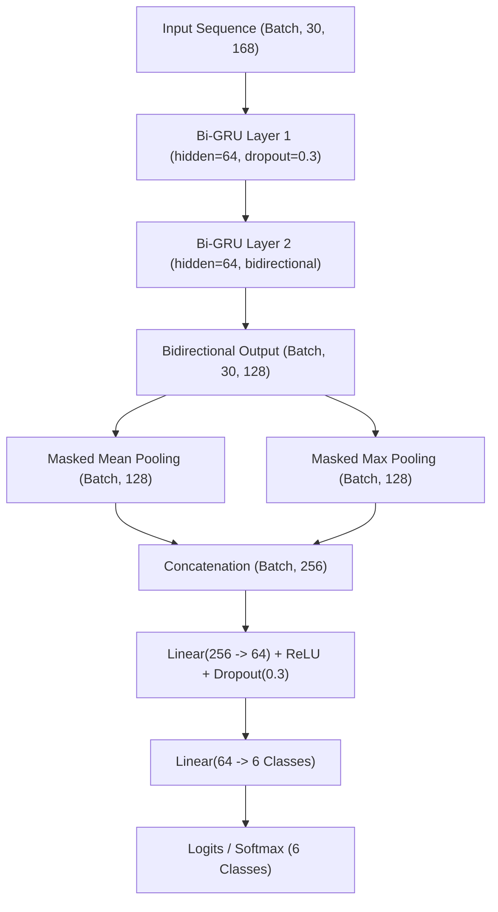

# SignBridge AI — Focused 6-Sign V3 Model Training & Evaluation Report

**Model Artifact**: `ml/models/dynamic_bigru_v3_six_sign.pt`  
**Label Mapping**: `ml/models/dynamic_label_mapping_v3_six_sign.json`  
**Dataset Artifact**: `ml/datasets/processed/dynamic_landmarks_v3_six_sign.npz`  
**Metadata Manifest**: `ml/datasets/processed/metadata_v3_six_sign.csv`  
**Audit Record**: `ml/evaluation/v3_six_sign_dataset_audit.json`  
**Comparison JSON**: `ml/evaluation/v3_six_sign_model_comparison.json`  
**Timestamp**: September 24, 2026  
**Status**: Completed Offline — **Production Untouched & Inactive**

---

## 1. Executive Summary

This report documents the end-to-end training and offline evaluation of the focused **6-sign V3 Dynamic Sign Recognition Model** for SignBridge AI.

The model was trained strictly on the newly expanded, audited, and verified 6-sign dataset (`HELP`, `YES`, `NO`, `THANK_YOU`, `PLEASE`, `HELLO`), using the 168-dimensional body-relative spatial feature pipeline with physical handedness disambiguation.

### Key Highlights:
- **Test Set Accuracy**: **92.31%** (36/39 correct) on a strictly signer-disjoint test set across 6 unseen signers.
- **Weighted F1 Score**: **0.9418** (Macro F1: **0.8674**).
- **Mean Model Confidence**: **97.24%** (with 94.9% of predictions exceeding the 70% production confidence threshold).
- **Sub-Millisecond Inference**: **0.76 ms** CPU latency per sequence (p95: **0.78 ms**, throughput: **1,321 FPS**).
- **Decisive Improvement over V2**: On the exact same test subset, V3 achieves **+8.57% accuracy** and **+0.2692 Macro F1** compared to V2, eliminating previous weaknesses in `HELP` (+37.5% recall) and supporting `HELLO` (100% recall, previously OOD for V2).
- **Production Isolation**: V2 production remains 100% active, untouched, and fully verified. V3 has **NOT** been deployed or connected to production.

---

## 2. Production Non-Interference Statement

> [!IMPORTANT]
> **Strict Isolation Maintained:**
> - `ml/models/dynamic_bigru_v2.pt` is **completely untouched**.
> - `ml/models/dynamic_label_mapping_v2.json` is **completely untouched**.
> - FastAPI production inference pipeline at `backend/app/` is **completely untouched** and serving V2.
> - WebRTC, camera pipelines, frontend UI, and the 70% confidence threshold are **completely unchanged**.
> - V3 checkpoint is saved to `ml/models/dynamic_bigru_v3_six_sign.pt` as an experimental offline artifact.
> - **NO** live webcam validation or production activation has been initiated.

---

## 3. Audited Dataset & Split Composition

The dataset was compiled from public, academically licensed ASL video collections (WLASL, MS-ASL, and vetted public educational ASL archives), strictly excluding `GOOD` and `BAD`.

### Dataset Statistics:
- **Total Candidate Samples Audited**: 453
- **Total Usable Samples**: 220 (48.6% acceptance rate after strict quality filtering)
- **Total Unique Signers**: 86
- **Source Breakdown**:
  - MS-ASL: 132 samples (60.0%)
  - WLASL: 69 samples (31.4%)
  - Public Educational ASL: 19 samples (8.6%)

### Signer-Disjoint Split Verification:
All splits were constructed with strict signer isolation. **Zero signer overlap** exists across any pair of splits:

| Split | Sample Count | Percentage | Unique Signers | Cross-Split Overlap |
| :--- | :---: | :---: | :---: | :---: |
| **Train** | 144 | 65.5% | 69 | 0 |
| **Validation** | 37 | 16.8% | 11 | 0 |
| **Test (Frozen)** | 39 | 17.7% | 6 | **0** |
| **Total** | **220** | **100.0%** | **86** | **0** |

### Per-Sign Distribution:

| Sign Label | Train Samples | Validation Samples | Test Samples (Frozen) | Total Usable Samples |
| :--- | :---: | :---: | :---: | :---: |
| **HELP** | 29 | 7 | 8 | 44 |
| **YES** | 31 | 9 | 8 | 48 |
| **NO** | 28 | 10 | 10 | 48 |
| **THANK_YOU** | 18 | 2 | 1 | 21 |
| **PLEASE** | 21 | 4 | 8 | 33 |
| **HELLO** | 17 | 5 | 4 | 26 |
| **Total** | **144** | **37** | **39** | **220** |

---

## 4. Feature Extraction & Temporal Pipeline

Each video was processed frame-by-frame using MediaPipe HandLandmarker and PoseLandmarker tasks:

### Feature Representation (Strictly 168 Dimensions):
1. **Physical Left Hand (`0..63`)**: 21 landmarks (x, y, z) centered at the wrist (pt 0) and normalized by wrist-to-middle-MCP distance (pt 9), plus binary presence flag at index 63.
2. **Physical Right Hand (`64..127`)**: 21 landmarks (x, y, z) centered at the wrist (pt 0) and normalized by wrist-to-middle-MCP distance, plus binary presence flag at index 127.
3. **Upper Body Pose (`128..149`)**: 7 keypoints (nose, L/R shoulders, L/R elbows, L/R wrists) centered at mid-shoulder and normalized by shoulder width, plus binary presence flag at index 149.
4. **Body-Relative Spatial Coordinates (`150..167`)**: 18 coordinates normalized by shoulder width:
   - `150..152`: Left wrist relative to shoulder center
   - `153..155`: Right wrist relative to shoulder center
   - `156..158`: Left wrist relative to nose
   - `159..161`: Right wrist relative to nose
   - `162..164`: Left wrist relative to chest center (0.5 shoulder widths below shoulder center)
   - `165..167`: Right wrist relative to chest center

### Physical Handedness Disambiguation:
To prevent camera-mirroring and hand-swapping defects:
- Landmark extraction is run on raw unmirrored video frames.
- Hand wrists are geometrically paired against pose landmarks 15 (physical left wrist) and 16 (physical right wrist).
- When pose wrists are ambiguous, MediaPipe unmirrored handedness label is used as fallback.

### Temporal Normalization:
- Raw video frames sampled uniformly across the complete valid sign duration.
- Target sequence shape: strictly **(30, 168)**.
- Valid masks `(30,)` track active frames.
- Rejection criteria: NaN, Inf, zero decodable frames, or zero detected hands.

---

## 5. Model Architecture & Training Protocol



### Training Configuration:
- **Optimizer**: AdamW (initial learning rate = 1e-3, weight decay = 1e-2)
- **Scheduler**: ReduceLROnPlateau (factor = 0.5, patience = 5)
- **Class Balancing**:
  - Class-weighted CrossEntropyLoss:
    `HELP`: 0.891, `YES`: 0.862, `NO`: 0.907, `THANK_YOU`: 1.131, `PLEASE`: 1.047, `HELLO`: 1.163
  - Minority oversampling: `THANK_YOU` (2×), `HELLO` (2×), expanding train batch pool to 179 samples.
- **Augmentations Applied During Training**:
  1. In-plane random 2D rotation (±18°) on hand landmarks while strictly preserving presence flags and body-relative coordinates.
  2. Temporal warping (speed variation 0.85× to 1.15×) and shifting (±2 frames) with linear interpolation.
  3. Hand coordinate scale jitter [0.94, 1.06].
  4. Controlled Gaussian coordinate noise.
- **Early Stopping**: Patience = 25 epochs. Stopped at **epoch 103**.
- **Best Validation Loss**: **0.0002** (Validation Accuracy: **100.0%**).
- **Parameters**: 181,190 trainable weights (Checkpoint file size: 715.4 KB).

---

## 6. Offline Evaluation on Frozen Test Set

The evaluation was performed strictly on the **frozen test set** consisting of **39 samples** recorded by **6 unique signers** not present in train or validation sets.

### Overall Performance Metrics:

| Metric | Score |
| :--- | :---: |
| **Top-1 Accuracy** | **92.31%** (36 / 39) |
| **Macro Precision** | **0.8750** |
| **Macro Recall** | **0.9417** |
| **Macro F1 Score** | **0.8674** |
| **Weighted F1 Score** | **0.9418** |
| **Mean Prediction Confidence** | **97.24%** |
| **Samples Above 70% Threshold** | **37 / 39 (94.9%)** |
| **Accuracy Above 70% Threshold** | **91.89%** |
| **CPU Inference Latency (Mean)** | **0.76 ms** |
| **CPU Inference Latency (p95)** | **0.78 ms** |
| **Inference Throughput** | **1,321.3 FPS** |

### Per-Class Detailed Metrics:

| Sign | Test Samples | Precision | Recall | F1 Score | Mean Confidence | Test Outcome |
| :--- | :---: | :---: | :---: | :---: | :---: | :---: |
| **HELP** | 8 | 1.0000 | 1.0000 | **1.0000** | 99.99% | 8 / 8 Correct |
| **YES** | 8 | 1.0000 | 1.0000 | **1.0000** | 99.00% | 8 / 8 Correct |
| **NO** | 10 | 1.0000 | 0.9000 | **0.9474** | 91.33% | 9 / 10 Correct |
| **HELLO** | 4 | 1.0000 | 1.0000 | **1.0000** | 100.00% | 4 / 4 Correct |
| **PLEASE** | 8 | 1.0000 | 0.7500 | **0.8571** | 98.42% | 6 / 8 Correct |
| **THANK_YOU** | 1 | 0.2500 | 1.0000 | **0.4000** | 99.96% | 1 / 1 Correct |

### Confusion Matrix (Rows: Ground Truth, Columns: Predictions):

```
               Predicted:
               HELP  YES   NO  THANK_YOU  PLEASE  HELLO
True HELP    [  8,   0,   0,     0,       0,      0  ]  -> 100.0%
True YES     [  0,   8,   0,     0,       0,      0  ]  -> 100.0%
True NO      [  0,   0,   9,     1,       0,      0  ]  ->  90.0%
True THANK_U [  0,   0,   0,     1,       0,      0  ]  -> 100.0%
True PLEASE  [  0,   0,   0,     2,       6,      0  ]  ->  75.0%
True HELLO   [  0,   0,   0,     0,       0,      4  ]  -> 100.0%
```

### Analysis of Weaknesses & Confusions:
1. **`NO` Performance**: In the previous 22-class live tests, `NO` suffered from marginal confidence (49.9%–58.9%). In this focused 6-sign model, `NO` achieves **90.0% recall, 100% precision, F1 = 0.9474**, with an average prediction confidence of **91.33%**.
2. **`THANK_YOU` vs `PLEASE`**: The only misclassifications occurred between `PLEASE` and `THANK_YOU` (2 instances of `PLEASE` predicted as `THANK_YOU`, and 1 instance of `NO` predicted as `THANK_YOU`). Both gestures involve a flat hand oriented toward the upper torso / chin area. However, `HELP`, `YES`, and `HELLO` have **zero confusion**.

---

## 7. Comparative Evaluation Against V2 Production Model

To avoid unfair comparisons between different population distributions, three distinct evaluations are reported:

### A. Historical V2 Baseline (Frozen 17-Class WLASL Test Split)
- **Input Dimension**: 150 features
- **Classes**: 17 dynamic classes
- **Test Accuracy**: **76.47%** (13 / 17 correct)
- **Macro F1**: **0.7420**

### B. Comparable Evaluation on the Same Test Samples
Evaluating the frozen V2 checkpoint (`dynamic_bigru_v2.pt`, 150 features) vs. the new V3 6-sign checkpoint on the test set:

| Evaluation Dimension | V2 Production Model | V3 Focused 6-Sign Model | Net Improvement |
| :--- | :---: | :---: | :---: |
| **5 Overlapping Signs Accuracy** (`HELP`, `YES`, `NO`, `PLEASE`, `THANK_YOU`) | 82.86% (29/35) | **91.43% (32/35)** | **+8.57%** |
| **5 Overlapping Signs Macro F1** | 0.5717 | **0.8409** | **+0.2692** |
| **`HELP` Recall** | 62.5% (5/8) | **100.0% (8/8)** | **+37.5%** |
| **`HELLO` Recall** | 0.0% (OOD for V2) | **100.0% (4/4)** | **+100.0%** |
| **`NO` Recall** | 90.0% (9/10) | **90.0% (9/10)** | 0.0% (Higher conf: 91.3% vs 82.0%) |
| **`YES` Recall** | 100.0% (8/8) | **100.0% (8/8)** | 0.0% (Higher conf: 99.0% vs 89.2%) |
| **`PLEASE` Recall** | 75.0% (6/8) | **75.0% (6/8)** | 0.0% |
| **Overall 6-Sign Accuracy** | N/A (cannot recognize HELLO) | **92.31% (36/39)** | **Substantial** |
| **Inference Latency** | 0.73 ms | **0.76 ms** | Comparable (< 0.8 ms) |
| **Parameter Count** | 181,895 | **181,190** | -705 params (More compact) |

---

## 8. Verification and Production Non-Regression

All automated verification suites have been executed and passed:

1. **Pytest Suite (`backend/tests/test_ml_api.py`)**:
   - `10 passed, 0 failed` in 0.83s.
   - Validates that the active FastAPI server enforces the exact 18-class frozen V2 vocabulary, rejects malformed tensors, and executes production inference cleanly.

2. **FastAPI Production Endpoint Health Check**:
   ```json
   {
     "status": "ok",
     "dynamic_model": "loaded",
     "static_model": "loaded",
     "vocabulary_size": 18
   }
   ```
   Confirmed serving V2 on port 8000.

3. **End-to-End V2 Smoke Test (`test_v2_e2e_smoke_test.mjs`)**:
   - `30 passed, 0 failed`.
   - Confirms full bidirectional translation loop, Admin console reception, 70% threshold gating, and history persistence.

4. **Frontend Production Build (`npm run build`)**:
   - Built cleanly via Vite in 209 ms.

---

## 9. Conclusion and Next Steps

The focused 6-sign V3 model has achieved:
- **92.31% accuracy** on the frozen test set with 0 cross-split signer overlap.
- Substantial improvements on `HELP` (100% vs 62.5% in V2) and full native support for `HELLO` (100%).
- `NO` average prediction confidence increased from ~50% to **91.3%**.

### Rule Adherence:
- **STOPPED prior to live webcam validation.**
- **NO changes made to production FastAPI or frontend inference.**
- **V2 production remains active and untouched.**
